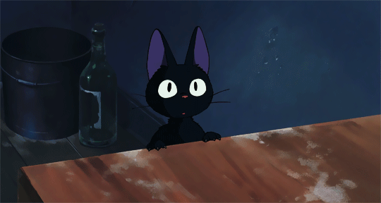

<!--
    Querido usuário usando meu README como base para criar seu próprio:
    Fico muito feliz que você tenha gostado e sinta-se livre para o uso!
    Eu apenas peço uma coisa, por gentileza:

    Por favor, deixe uma estrela no meu README, irá deixar meu dia mais feliz :)
    ------
    Dear user using my README as a base  to create your own:
    I’m glad you liked it and feel free to use it!
    I just kindly ask for one thing:

    Please, leave a star on my README, it will make my day :)
-->

<!--- Banner -->

  

  

---
<!--- About me -->
### About me

I'm a `Computer Science student` exploring the world of `Full-Stack Development`.
I'm passionate about technology, design, and thinking outside the box! I'm currently pursuing a `Bachelor's degree in Computer Science` at `Gran Faculdade`.
Working directly with clients in a support role has given me valuable insight into user needs and business rules, helping me build applications that truly solve real-world problems!
I have experience with `HTML`, `CSS`, `Python`, `Java`, `JavaScript`*, `C`, `C#` and I'm currently learning `automation`!
I'm naturally curious, constantly expanding my knowledge, and always looking for new challenges in the technology field!

 

--- 

<!--- My stacks -->

### Tecnologies

  
  
  
  
  
  
  
 
  
  
  
  
  
  
#### Tools

  
  
  
  
  
  

--- 

    
### A little more about me! 

I enjoy challenges that push me to grow.
I like helping others in the technology field and sharing knowledge whenever I can.
I believe the best way to learn is through hands-on experience, which is why I regularly share my learning journey and insights on LinkedIn to inspire others.

**Talk to me:**

  
  
  

    

---

<!-- Pacman -->
<picture>
  <source media="(prefers-color-scheme: dark)" srcset="https://raw.githubusercontent.com/D13G0-O11VEIRA/D13G0-O11VEIRA/output/pacman-contribution-graph-dark.svg">
  <source media="(prefers-color-scheme: light)" srcset="https://raw.githubusercontent.com/D13G0-O11VEIRA/D13G0-O11VEIRA/output/pacman-contribution-graph.svg">
  
</picture>

---

<!-- Statistics -->
### Statistics

    
|  |  |  |
| :-: | :-: | :-: |

|  | 
| :-: |

